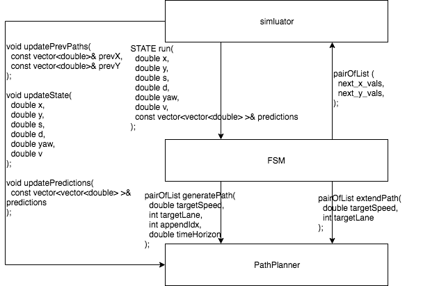
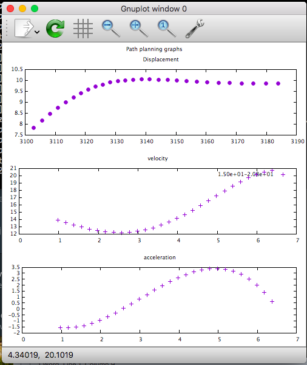
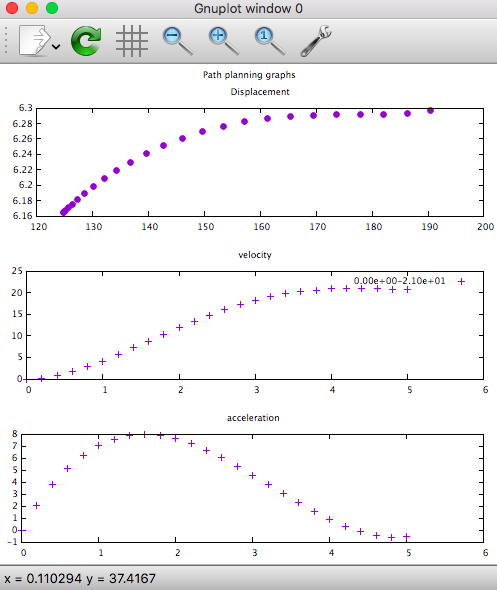
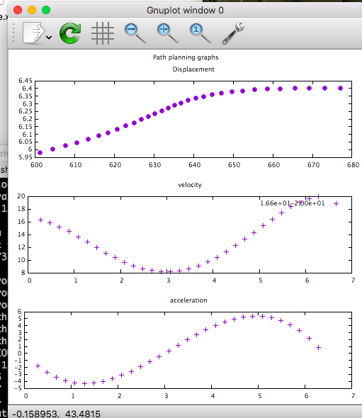

# CarND-Path-Planning-Project

## Software Architecture Overview

1. See diagram below

## Module breakdown - FSM

This is the finite state machine responsible for high level decision making. It has 6 states - ready, notReady, keepLane, laneChangeLeft, laneChangeRight, final. Final is the only accepting state. At every call of run(), the fsm performs the following steps in order:

1. updates localization and environment information, including maximum safe speed for every lane
2. checks with PathPlanner if we are still in transit to the next state, if yes updates currentState to nextState
3. if still in transit, we do not calculate next state. Instead we call PathPlanner.extendPath() which takes the last 2 points of the current trajectory and simply extends it with same velocity and 0 acceleration.
4. if not in transit, we run through all the possible transitions and calculate the cost with respect to each possible transition. The 3 cost functions are:
 - goalCost : distance of targetLane from goal
 - inefficiencyCost : distance of maximum speed in targetLane from speed limit
 - safetyCost : checks for s distance to car in front and behind for targetLane
5. We take the target configuration with lowest cost, which may be keepLane, laneChangeLeft or laneChangeRight. Depending on the target configuration, we ask the PathPlanner to:
 - if keepLane and targetSpeed is different from currentSpeed by more than 5 mph, we ask the PathPlanner to generate a new trajectory, else we simply extend the current trajectory with PathPlanner.extendPath()
 - if target configuration is laneChangeLeft or laneChangeRight, we call PathPlanner.generatePath()

Since FSM is a high level module, units are in miles per hour.

## Module breakdown - PathPlanner

The PathPlanner is a low level module responsible for planning and executing the high level decisions made by the FSM. It also takes in environment information and calculates collision trajectories for other cars, and factors that in when generating trajectories and weighting them.

Generate path is used to generate a JMT trajectory for a given targetLane and targetSpeed. Given an appendIdx, the index in the previous x-y path generated to start generating the new trajectory from, and the time horizon T to generate for, we first calculate the displacement S using S = 1/2 * (u + v) * T where u is initial speed and v is targetSpeed. Next, we draw N samples of varying { S, D, T } configurations, where S represents final S and D represents final D in frenet coordinates. For each sample, we generate a JMT and evaluate its feasibility according to these criteria:

1. End S coordinate must be of a safety following distance behind the nearest car in front of lane
2. D coordinate at any point of the trajectory must stay within lanes 1 - 3.
3. Velocity cannot be negative (reverse direction) and must be less than 22 m/s
4. Max acceleration and deceleration must stay within program constraints.
5. Steering angle at every point must be within steering angle limits.
6. Final heading of vehicle must be parallel to lane curvature

Subsequently, we use a cost function to choose 1 feasible trajectory out of all feaible trajectories. The cost function takes into account the following:

1. Closeness to center of lane
2. Safety distance to car in front
3. Safety distance to car behind
4. Time spent in between lanes
5. Variance of velocity
6. Variance in acceleration
7. Comfort - jerk in d-direction

The JMT function, is as taught in the lesson, takes in start S, start S velocity, start S acceleration, end S, end S velocity and end S acceleration. We have to use the correct starting values based on appendIdx in order to ensure a smooth transition, hence, we have to store these values every iteration. We can repeat this process for the D direction to obtain S-t and D-t trajectories, combining them gives us S-D trajectory which we can then convert to X-Y coordinates.

Finally, the conversion from frenet to x-y coordinates introduces some kinks in the path at map waypoints boundaries as the conversion function is not exact, hence, we apply a smoothen function by fitting a cubic polynomial spline curve to 5 points chosen at equal intervals along the transformed trajectory in x-y coordinates.

Generating a new path is tricky and often leads to violations of the program requirements when not done correctly, hence, whenever possible, we try to extend an existing jerk minial path using the extendPath function. The most usual case is when we want to keep lane and the target speed and current speed do not differ by much.

Since PathPlanner is a low level module, units are in metres per second.

## Event loop - how to generate Jerk Minimizing Trajectories

## Example trajectories

1. Lane change left or right example. 
2. Speed up from 0 to 47 miles per hour. 
3. Slow down because ego car is approaching car in front. 

## Challenges

1. The path planner is known to not work well if a car suddenly cuts into ego car's lane and there is very little distance to car in front to work out a new trajectory. The drastic reduction in feasible search space makes this a challenging problem.

## Solutions

## Future improvements
